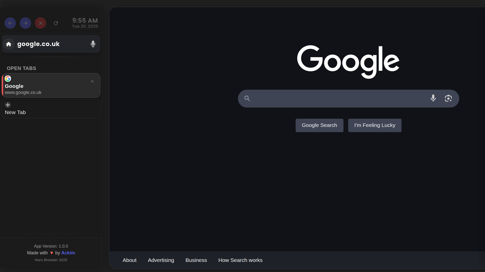

# Nuru Browser

A modern, optimized Electron-based web browser with a minimalistic interface, inspired by the Arc browser design. Features hardware acceleration, tabs management, animated controls, and a focus on performance and aesthetics.



## Features

- **Modern UI**: Arc-inspired frameless window with a modern tab system and rounded borders
- **Dark Mode**: Sleek dark theme with Poppins SemiBold font
- **Animated Controls**: Interactive animated navigation buttons and menu controls
- **Minimal Interface**: Clean, distraction-free browsing experience
- **Hardware Acceleration**: WebGL support with automatic detection
- **Auto Updates**: Built-in system to keep the browser up-to-date with latest releases
- **Diagnostics**: Built-in diagnostics window (Ctrl+D) with app info, WebGL status, and logs
- **Zoom Control**: Built-in zoom functionality (Ctrl+/Ctrl-)
- **Persistent Settings**: Remembers window geometry, zoom level, and other preferences

## Development

### Prerequisites

- Node.js (v16 or later)
- npm (v8 or later)

### Setup

1. Clone the repository
2. Install dependencies:
   ```
   npm install
   ```
3. Start the application:
   ```
   npm start
   ```

### Building

To build the application for production:

```
npm run build
```

This will create distributable packages in the `dist` directory.

## Configuration

Settings are stored in `nuru_browser_settings.json` in the app's user data directory. Default settings:

- Dark mode: Enabled
- Frameless mode: Enabled
- Zoom factor: 1.5 (150%)

## Keyboard Shortcuts

- `Ctrl+D`: Open diagnostics window
- `Ctrl+Plus`: Zoom in
- `Ctrl+Minus`: Zoom out
- `Ctrl+S`: Show URL bar
- `Ctrl+T`: Open new tab
- `Ctrl+W`: Close current tab

## Logs

Logs are stored in `nuru_browser.log` in the app's user data directory and can be viewed in the diagnostics window.
