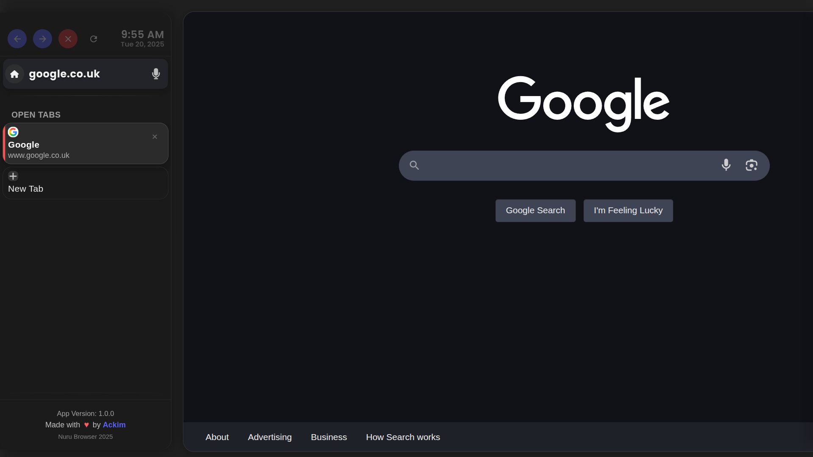

# Nuru Browser

A modern, optimized Electron-based web browser with a minimalistic interface, inspired by the Arc browser design. Features hardware acceleration, tabs management, animated controls, and a focus on performance and aesthetics.



## Features

- **Modern UI**: Arc-inspired frameless window with a modern tab system and rounded borders
- **Dark Mode**: Sleek dark theme with Poppins SemiBold font, automatic detection of system theme, and adjustable brightness/contrast settings
- **Animated Controls**: Interactive animated navigation buttons and menu controls
- **Minimal Interface**: Clean, distraction-free browsing experience
- **Hardware Acceleration**: WebGL support with automatic detection
- **Auto Updates**: Built-in system to keep the browser up-to-date with latest releases
- **Diagnostics**: Built-in diagnostics window (Ctrl+D) with app info, WebGL status, and logs
- **Zoom Control**: Built-in zoom functionality (Ctrl+/Ctrl-)
- **Persistent Settings**: Remembers window geometry, zoom level, and other preferences
- **Ad Blocker**: Blocks ads on web pages for a cleaner browsing experience
- **Search Engine Customization**: Configure default search engine name, URL, and icon
- **Settings UI**: Access and modify settings via a built-in settings modal
- **Development Mode**: Enable development mode for additional debugging features
- **Custom Taskbar Icon**: Displays a 48×48 Nuru Browser logo in the taskbar, configured via `src/main.js`
- **Reading Mode**: Article reading mode with inline detection and distraction-free view
- **Resource Manager**: Manage custom resources/categories via the Nuru Selects modal
- **Search History & Suggestions**: Persistent search history and suggestion dropdown for the address bar
- **External Link Handling**: Opens new windows and links in tabs with context menu support
- **Enhanced Context Menu**: Rich clipboard context menu with copy, paste, and open link in new tab options
- **Media Progress Tracking**: Tracks and displays in-page audio/video playback progress via injected media listeners

## Usage
Nuru Browser provides a streamlined browsing workflow:
1. Type URLs or search queries in the address bar and press Enter to navigate.
2. Use the tab bar to open (`Ctrl+T`), switch, and close tabs (`Ctrl+W`) with mouse or keyboard.
3. Adjust zoom with `Ctrl+Plus` / `Ctrl+-`; press `Ctrl+0` to reset to default.
4. Enable Reading Mode on article pages via the book icon in the toolbar for distraction-free reading.
5. Open Diagnostics (`Ctrl+D`) or Settings (`Ctrl+S`) at any time for advanced controls.

## Configuration
Preferences are saved to `nuru_browser_settings.json` in your system's user data directory. Example default:

```json
{
  "frameless": true,
  "zoom_factor": 1.5,
  "search_engine": {
    "name": "google",
    "url": "https://www.google.com/search?q=",
    "icon": "fab fa-google"
  },
  "features": {
    "adblock": true
  }
}
```

## Development

### Prerequisites

- Node.js (v16 or later)
- npm (v8 or later)

### Setup

1. Clone the repository
2. Install dependencies:
   ```
   npm install
   ```
3. Start the application:
   ```
   npm start
   ```

### Building

To build the application for production:

```
npm run build
```

This will create distributable packages in the `dist` directory.

## Running Without Terminal

To run Nuru Browser without using the terminal, you can use the provided desktop shortcut:

1. Ensure the `NuruBrowser.desktop` file is located in `~/.local/share/applications/` or on your desktop.
2. Make the file executable:
   ```bash
   chmod +x ~/path/to/NuruBrowser.desktop
   ```
3. Double-click the shortcut to launch Nuru Browser with the app logo.

## Keyboard Shortcuts

- `Ctrl+D`: Open diagnostics window
- `Ctrl+Plus`: Zoom in
- `Ctrl+Minus`: Zoom out
- `Ctrl+S`: Show URL bar
- `Ctrl+T`: Open new tab
- `Ctrl+W`: Close current tab

## Logs

Logs are stored in `nuru_browser.log` in the app's user data directory and can be viewed in the diagnostics window.
